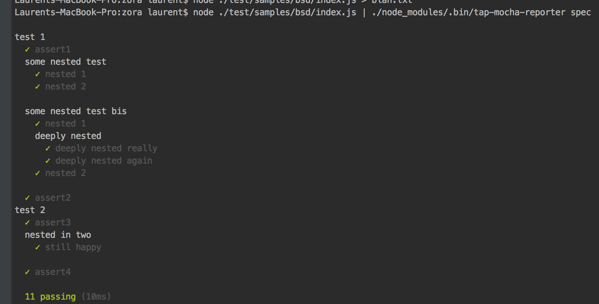

# zora

Fast javascript testing library for **nodejs** and **browsers**

[](https://circleci.com/gh/lorenzofox3/zora)
[](https://www.npmjs.com/package/zora)
[](https://packagephobia.now.sh/result?p=zora)

[Gitlab mirror](https://gitlab.com/zora-test/zora)

## installation

``npm i --save-dev zora``

If you are interested in a test runner for Nodejs, checkout [pta](https://github.com/lorenzofox3/zora-node) built on top of zora

## (Un)Opinions and Design

These are the following rules and ideas I have followed while developing zora. Whether they are right or not is an entire different topic ! :D
Note I have decided to develop zora specially because I was not able to find a tool which complies entirely with these ideas.

[read more](https://dev.to/lorenzofox3/tools-and-the-design-of-a-testing-experience-2mdc) on how it fits in the [UNIX philosophy](https://en.wikipedia.org/wiki/Unix_philosophy) or on how [it can achieve great performances](https://dev.to/lorenzofox3/there-is-beauty-in-simplicity-1npe).

### Tests are regular Javascript programs.

You don't need a specific test runner, a specific platform or any build step to run your `zora` tests. They are only regular valid EcmaScript 2018 programs.
If you have the following test.
```Javascript
import {test} from 'path/to/zora';

test('should result to the answer', t => {
    const answer = 42;
    t.equal(answer, 42, 'answer should be 42');
});
```

You can run your test with
1. Node: ``node ./myTestFile.js``
2. In the browser ``<script type="module" src="./myTestFile.js></script>`` identically

Moreover zora does not use specific platform API which should make it transparent to most of your tools such module bundlers or transpilers.

In few words:
> Zora is EcmaScript, no less, no more.

### Tests are fast

Tests are part of our daily routine as software developers. Performance is part of the user experience and there is no reason you should wait seconds for your tests to run.
Zora is by far the **fastest** Javascript test runner in the ecosystem.

#### Benchmark

This repository includes a benchmark which consists on running N test files, with M tests in each and where one test lasts T milliseconds.
About 5% of tests should fail.

1. profile library: N = 5, M = 8, T = 25ms
2. profile web app: N = 10, M = 8, T = 40ms
3. profile api: N =12, M = 10, T = 100ms

Each framework runs with its default settings.

Here are the result of different test frameworks on my developer machine (MacBook Pro, 2.7GH i5) with node 12 :

|        |  zora@3.1.8  |   pta@0.1.3  |  tape@4.13.0 |  Jest@25.1.0  |  AvA@3.0.0  |  Mocha@7.0.0|
|--------|:------------:|:------------:|:------------:|:-------------:|:------------:|:----------:|
|Library |    109ms     |     225ms    |    1236ms    |    2636ms     |    1311ms    |    1427ms  |
|Web app |    130ms     |     261ms    |    3602ms    |    5595ms     |    2034ms    |    3716ms  |
|API     |    212ms     |     329ms    |   12569ms    |    6606ms     |    2496ms    |   12764ms  |

Of course as any benchmark, it may not cover your use case and you should probably run your own tests before you draw any conclusion.

### Focus on tests only

zora does one thing but hopefully does it well: **test**.

In my opinions:
1. Pretty reporting (I have not said *efficient reporting*) should be handled by a specific tool.
2. Transpilation and other code transformation should be handled by a specific tool.
3. File watching and caching should be handled by a specific tool.
4. File serving should be handled by a specific tool.
5. Coffee should be made by a specific tool.

As a result zora is much smaller of an install according to [packagephobia](https://packagephobia.now.sh) than all the others test frameworks

|        |  zora  |  pta  |tape |  Jest  |  AvA  |  Mocha|
|--------|:------------:|:------------:|:-----------:|:-------------:|:------------:|:------------:|
|Install size |  [](https://packagephobia.now.sh/result?p=zora)  |  [](https://packagephobia.now.sh/result?p=pta)  |  [](https://packagephobia.now.sh/result?p=tape)  |  [](https://packagephobia.now.sh/result?p=jest) |  [](https://packagephobia.now.sh/result?p=ava) |  [](https://packagephobia.now.sh/result?p=mocha) |

### Reporting is handled with another process (TAP aware)

When you run a test you usually want to know whether there is any failure, where and why in order to debug and solve the issue as fast as possible.
Whether you want it to be printed in red, yellow etc is a matter of preference.

For this reason, zora output [TAP](http://testanything.org/) (Test Anything Protocol) by default. This protocol is "machine friendly" and widely used: [there are plenty of tools](https://github.com/sindresorhus/awesome-tap) to parse and deal with it the way **you** want.

## Usage

### Basics

You can use the top level assertion methods

```Javascript
import {equal, ok, isNot} from 'zora';

ok(true,'true is truthy');

equal('bar','bar', 'that both string are equivalent');

isNot({},{},'those are not the same reference');

//etc
```

If you run the previous program, test report will start on its own by default with the following console output:

<details>
    <summary>output.txt</summary>

```TAP
TAP version 13
ok 1 - true is truthy
ok 2 - that both string are equivalent
ok 3 - those are not the same reference
1..3

# ok
# success: 3
# skipped: 0
# failure: 0
```

</details>

However one will usually want to group assertions within a sub test: the ``test`` method can be used.

```Javascript
import {test} from 'zora';

test('some grouped assertions', t => {
    t.ok(true, 'true is truthy');
    t.equal('bar', 'bar', 'that both string are equivalent');
    t.isNot({}, {}, 'those are not the same reference');
});
```

with the following result

<details>
    <summary>output.txt</summary>

```TAP
TAP version 13
# some grouped assertions
ok 1 - true is truthy
ok 2 - that both string are equivalent
ok 3 - those are not the same reference
1..3

# ok
# success: 3
# skipped: 0
# failure: 0
```

</details>

You can also group tests within a parent test:

```Javascript
import {test} from 'zora';

test('some grouped assertions', t => {
    t.ok(true, 'true is truthy');

    t.test('a group inside another one', t=>{
        t.equal('bar', 'bar', 'that both string are equivalent');
        t.isNot({}, {}, 'those are not the same reference');
    });
});
```
<details>
    <summary>output.txt</summary>
    
```TAP
TAP version 13
# some grouped assertions
ok 1 - true is truthy
# a group inside another one
ok 2 - that both string are equivalent
ok 3 - those are not the same reference
1..3

# ok
# success: 3
# skipped: 0
# failure: 0
```
</details>

### Asynchronous tests and control flow

Asynchronous tests are simply handled with async function:

```Javascript
test('with getUsers an asynchronous function returning a Promise',async t => {
    const users = await getUsers();
    t.eq(users.length, 2,'we should have 2 users');
});
```

Notice that each test runs in its own micro task in parallel (for performance). It implies your tests should not depend on each other.
It is often a good practice!
However, you'll be able to group your tests if you wish to conserve some state between them or wait one to finish before you start another one (ideal with tests running against real database).

The sequence is simply controlled by AsyncFunction (and await keyboard), the ``test`` function return the result of its spec function argument, so you can control whether you want a specific test to complete before moving on

```Javascript
let state = 0;

test('test 1', t => {
    t.ok(true);
    state++;
});

test('test 2', t => {
    //Maybe yes maybe no, you have no guarantee ! In this case it will work as everything is sync
    t.equal(state, 1);
});

//Same thing here even in nested tests
test('grouped', t => {
    let state = 0;

    t.test('test 1', t => {
        t.ok(true);
        state++;
    });

    t.test('test 2', t => {
        //Maybe yes maybe no, you have no guarantee ! In this case it will work as everything is sync
        t.equal(state, 1);
    });
});

//And
test('grouped', t=>{
    let state = 0;

    t.test('test 1', async t=>{
        t.ok(true);
        await wait(100);
        state++;
    });

    test('test 2', t=>{
        t.equal(state, 0, 'see the old state value as it will have started to run before test 1 is done');
    });
});

//But
test('grouped', async t => {
    let state = 0;

    //specifically wait the end of this test before continuing !
    await t.test('test 1', async t => {
        t.ok(true);
        await wait(100);
        state++;
    });

    test('test 2', t => {
        t.equal(state, 1, 'see the updated value!');
    });
});
```

### Changing TAP format

TAP protocol is loosely defined in the sense that diagnostic is quite a free space and there is no well defined format to explicit a sub tests.
In Javascript community most of the TAP parsers and tools were designed for [tape](https://github.com/substack/tape) which implies a TAP comment for a sub test header and every assertion is on the same level.
In the same way these aforementioned tools expect diagnostics with a ``expected``, ``actual``, etc properties
It is the one we have used in our previous examples.

If you run the following program
```Javascript
import {test} from 'zora';

test('tester 1', t => {

    t.ok(true, 'assert1');

    t.test('some nested tester', t => {
        t.ok(true, 'nested 1');
        t.ok(true, 'nested 2');
    });

    t.test('some nested tester bis', t => {
        t.ok(true, 'nested 1');

        t.test('deeply nested', t => {
            t.ok(true, 'deeply nested really');
            t.ok(true, 'deeply nested again');
        });

        t.notOk(true, 'nested 2'); // This one will fail
    });

    t.ok(true, 'assert2');
});

test('tester 2', t => {
    t.ok(true, 'assert3');

    t.test('nested in two', t => {
        t.ok(true, 'still happy');
    });

    t.ok(true, 'assert4');
});
```
<details>
    <summary>output.txt</summary>
    
```TAP
TAP version 13
# tester 1
ok 1 - assert1
# some nested tester
ok 2 - nested 1
ok 3 - nested 2
# some nested tester bis
ok 4 - nested 1
# deeply nested
ok 5 - deeply nested really
ok 6 - deeply nested again
not ok 7 - nested 2
  ---
  actual: true
  expected: "falsy value"
  operator: "notOk"
  at: " t.test.t (/Volumes/Data/code/zora/test/samples/cases/nested.js:20:11)"
  ...
ok 8 - assert2
# tester 2
ok 9 - assert3
# nested in two
ok 10 - still happy
ok 11 - assert4
1..11

# not ok
# success: 10
# skipped: 0
# failure: 1
```

</details>

Another common structure is the one used by [node-tap](http://node-tap.org/). The structure can be parsed with common tap parser (such as [tap-parser](https://github.com/tapjs/tap-parser)) And will be parsed as well by tap parser which
do not understand the indentation. However to take full advantage of the structure you should probably use a formatter (such [tap-mocha-reporter](https://www.npmjs.com/package/tap-mocha-reporter)) aware of this specific structure to get the whole benefit
of the format.



You can ask zora to indent sub tests with configuration flag: 
1. setting node environment variable ``INDENT=true node ./path/to/test/program`` if you run the test program with node
2. setting a global variable on the window object if you use the browser to run the test program 
```markup
<script>INDENT=true;</script>
<script src="path/to/test/program"></script>
```

```Javascript
const {test} = require('zora.js');

test('tester 1', t => {

    t.ok(true, 'assert1');

    t.test('some nested tester', t => {
        t.ok(true, 'nested 1');
        t.ok(true, 'nested 2');
    });

    t.test('some nested tester bis', t => {
        t.ok(true, 'nested 1');

        t.test('deeply nested', t => {
            t.ok(true, 'deeply nested really');
            t.ok(true, 'deeply nested again');
        });

        t.notOk(true, 'nested 2'); // This one will fail
    });

    t.ok(true, 'assert2');
});

test('tester 2', t => {
    t.ok(true, 'assert3');

    t.test('nested in two', t => {
        t.ok(true, 'still happy');
    });

    t.ok(true, 'assert4');
});
```

<details>
    <summary>output.txt</summary>

```TAP
TAP version 13
# Subtest: tester 1
    ok 1 - assert1
    # Subtest: some nested tester
        ok 1 - nested 1
        ok 2 - nested 2
        1..2
    ok 2 - some nested tester # 1ms
    # Subtest: some nested tester bis
        ok 1 - nested 1
        # Subtest: deeply nested
            ok 1 - deeply nested really
            ok 2 - deeply nested again
            1..2
        ok 2 - deeply nested # 1ms
        not ok 3 - nested 2
          ---
          wanted: "falsy value"
          found: true
          at: " t.test.t (/Volumes/Data/code/zora/test/samples/cases/nested.js:22:11)"
          operator: "notOk"
          ...
        1..3
    not ok 3 - some nested tester bis # 1ms
    ok 4 - assert2
    1..4
not ok 1 - tester 1 # 1ms
# Subtest: tester 2
    ok 1 - assert3
    # Subtest: nested in two
        ok 1 - still happy
        1..1
    ok 2 - nested in two # 0ms
    ok 3 - assert4
    1..3
ok 2 - tester 2 # 0ms
1..2

# not ok
# success: 10
# skipped: 0
# failure: 1
```

</details>

### Skip a test

You can decide to skip some tests if you wish not to run them, in that case they will be considered as _passing_. However the assertion summary at the end will tell you that some tests have been skipped
and each skipped test will have a tap skip directive.

```Javascript
import {ok, skip, test} from 'zora';

ok(true, 'hey hey');
ok(true, 'hey hey bis');

test('hello world', t => {
    t.ok(true);
    t.skip('blah', t => {
        t.ok(false);
    });
    t.skip('for some reason');
});

skip('failing text', t => {
    t.ok(false);
});
```

<details>
    <summary>output.txt</summary>

```TAP
TAP version 13
ok 1 - hey hey
ok 2 - hey hey bis
# hello world
ok 3 - should be truthy
# blah
ok 4 - blah # SKIP
# for some reason
ok 5 - for some reason # SKIP
# failing text
ok 6 - failing text # SKIP
1..6

# ok
# success: 3
# skipped: 3
# failure: 0
```

</details>

### Run only some tests

While developing, you may want to only run some tests. You can do so by using the ``only`` function. If the test you want to run has
some sub tests, you will also have to call ``assertion.only`` to make a given sub test run.
You will also have to set the ``RUN_ONLY`` flag to ``true`` (in the same way as ``INDENT``). ``only`` is a convenience 
for a developer while working, it has not real meaning for the testing program, so if you use only in the testing program and run it without the RUN_ONLY mode, it will bailout.

```javascript
test('should not run', t => {
    t.fail('I should not run ');
});

only('should run', t => {
    t.ok(true, 'I ran');

    t.only('keep running', t => {
        t.only('keeeeeep running', t => {
            t.ok(true, ' I got there');
        });
    });

    t.test('should not run', t => {
        t.fail('shouldn ot run');
    });
});

only('should run but nothing inside', t => {
    t.test('will not run', t => {
        t.fail('should not run');
    });
    t.test('will not run', t => {
        t.fail('should not run');
    });
});
```

If you run the following program with node ``RUN_ONLY node ./path/to/program.js``, you will get the following output:

<details>
    <summary>output.txt</summary>
    
```tap
TAP version 13
# should not run
ok 1 - should not run # SKIP
# should run
ok 2 - I ran
# keep running
# keeeeeep running
ok 3 -  I got there
# should not run
ok 4 - should not run # SKIP
# should run but nothing inside
# will not run
ok 5 - will not run # SKIP
# will not run
ok 6 - will not run # SKIP
1..6

# ok
# success: 2
# skipped: 4
# failure: 0
```

</details>


### Assertion API

- equal<T>(actual: T, expected: T, message?: string) verify if two values/instances are equivalent. It is often described as *deepEqual* in assertion libraries.
aliases: eq, equals, deepEqual
- notEqual<T>(actual: T, expected: T, message?: string) opposite of equal.
aliases: notEquals, notEq, notDeepEqual
- is<T>(actual: T, expected: T, message ?: string) verify whether two instances are the same (basically it is Object.is)
aliases: same
- isNot<T>(actual: T, expected: T, message ?: string)
aliases: notSame
- ok<T>(actual: T, message?: string) verify whether a value is truthy
aliases: truthy
- notOk<T>(actual: T, message?:string) verify whether a value is falsy
aliases: falsy
- fail(message?:string) an always failing test, usually when you want a branch of code not to be traversed
- throws(fn: Function, expected?: string | RegExp | Function, description ?: string) expect an error to be thrown, you check the expected error by Regexp, Constructor or name
- doesNotThrow(fn: Function, expected?: string | RegExp | Function, description ?: string) expect an error not to be thrown, you check the expected error by Regexp, Constructor or name

### Create manually a test harness

You can discard the default test harness and create your own. This has various effects:
- the reporting won't start automatically, you will have to trigger it yourself but it also lets you know when the reporting is over
- you can pass a custom reporter. Zora produces a stream of messages which are then transformed into a TAP stream. If you create the test harness yourself
you can directly pass your custom reporter to transform the raw messages stream.

```Javascript
const {createHarness} = require('zora');
const {indentedTapReporter} = require('zora-tap-reporter');

const harness = createHarness();
const {test} = harness;

test('a first sub test', t => {
    t.ok(true);

    t.test('inside', t => {
        t.ok(true);
    });
});

test('a first sub test', t => {
    t.ok(true);

    t.test('inside', t => {
        t.ok(false, 'oh no!');
    });
});

harness
    .report(indentedTapReporter())
    .then(() => {
        // reporting is over: we can release some pending resources
        console.log('DONE !');
        // or in this case, our test program is for node so we want to set the exit code ourselves in case of failing test.
        const exitCode = harness.pass === true ? 0 : 1;
        process.exit(exitCode);
    });
```

In practice you won't use this method unless you have specific requirements or want to build your own test runner on top of zora.

## Nodejs test runner

If you want a little bit more opiniated test runner based on zora you can check [pta](https://github.com/lorenzofox3/zora-node)

## In the browser

Zora itself does not depend on native Nodejs modules (such file system, processes, etc) so the code you will get is regular EcmaScript.

### drop in file
You can simply drop the dist file in the browser and write your script below (or load it).
You can for example play with this [codepen](https://codepen.io/lorenzofox3/pen/YBWJrJ)

```Html
<!-- some content -->
<body>
<script type="module">

import test from 'path/to/zora';

test('some test', (assert) => {
    assert.ok(true, 'hey there');
})

test('some failing test', (assert) => {
    assert.fail('it failed');
})
</script>
</body>
<!-- some content -->
```

### As part of CI (example with rollup)

I will use [rollup](http://rollupjs.org/) for this example, but you should not have any problem with [webpack](https://webpack.github.io/) or [browserify](http://browserify.org/). The idea is simply to create a test file your testing browsers will be able to run.

assuming you have your entry point as follow :
```Javascript
//./test/index.js
import test1 from './test1.js'; // some tests here
import test2 from './test2.js'; // some more tests there
import test3 from './test3.js'; // another test plan
```

where for example ./test/test1.js is
```Javascript
import test from 'zora';

test('mytest', (assertions) => {
    assertions.ok(true);
})

test('mytest', (assertions) => {
    assertions.ok(true);
});
```
you can then bundle your test as single program.

```Javascript
const node = require('rollup-plugin-node-resolve');
const commonjs = require('rollup-plugin-commonjs');
module.exports = {
    input: './test/index.js',
    output: [{
        name: 'test',
        format: 'iife',
        sourcemap: 'inline' // ideal to debug
    }],
    plugins: [node(), commonjs()], //you can add babel plugin if you need transpilation
};
```

You can now drop the result into a debug file
``rollup -c path/to/conf > debug.js``

And read with your browser (from an html document for example).


Even better, you can use tap reporter browser friendly such [tape-run](https://www.npmjs.com/package/tape-run) so you'll have a proper exit code depending on the result of your tests.

so all together, in your package.json you can have something like that
```Javascript
{
// ...
  "scripts": {
    "test:ci": "rollup -c path/to/conf | tape-run"
  }
// ...
}
```

## On exit codes

Whether you have failing tests or not, unless you have an unexpected error, the process will return an exit code 0: zora considers its duty is to run the program to its end whether there is failing test or no.
Often CI platforms require an exit code of 1 to mark a build as failed. That is not an issue, there are plenty of TAP reporters which when parsing a TAP stream will exit the process with code 1 if they encounter a failing test.
Hence you'll need to pipe zora output into one of those reporters to avoid false positive on your CI platform.

For example, one of package.json script can be
``"test:ci": npm test | tap-set-exit``

## Contributing

1. Clone the repository with git ``git https://github.com/lorenzofox3/zora.git`` (or from Github/Gitlab UI)
2. install dependencies ``npm i``
3. build the source files ``npm run build``. Alternatively, if you are under "heavy" development you can run ``npm run dev`` it will build source files on every change
4. run the tests ``npm t``
