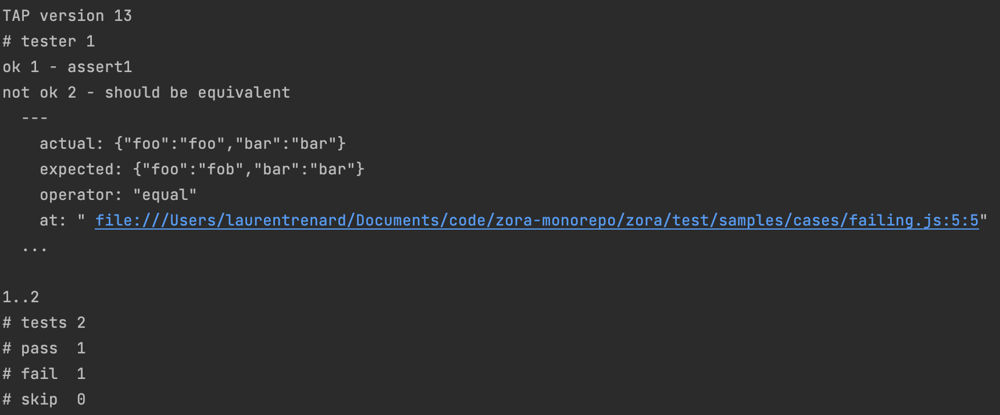
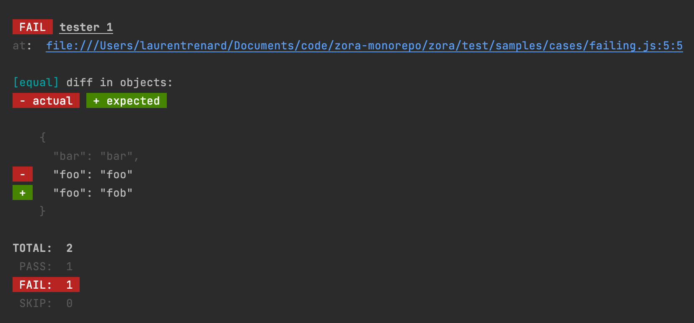

# zora-reporters

A set of reporters to programmatically (or via a CLI) consume a stream made of the zora testing protocol.

## installation

``npm i zora-reporters``

## zora testing protocol messages

A zora test harness is actually a stream of messages defined by the following interfaces

```typescript
interface IMessage<T> {
  type: string;
  data: T;
}

interface INewTestMessage extends IMessage<INewTestMessageInput> {
  type: 'TEST_START';
}

interface IAssertionMessage extends IMessage<IAssertionResult<unknown>> {
  type: 'ASSERTION';
}

interface ITestEndMessage extends IMessage<ITestEndMessageInput> {
  type: 'TEST_END';
}
```

## usage

### programmatically

create the reporter with a factory which you can then pass to the ``report`` function of any test harness (or to the ``report`` function of the default test harness)

```javascript
import {hold, report, test} from 'zora';
import {createDiffReporter} from 'zora-reporters';

hold(); // prevent the default test harness to start its reporting

test(`some test`, (t) => {
    t.ok(true)
});

// create your custom reporter
const reporter = createDiffReporter();

// start reporting
report({reporter});
```

### CLI 

Zora testing program will output by default a TAP report, but you can configure it to output the zora testing protocol instead (thanks to the ``ZORA_REPORTER=json`` en variable for example).

You can then pipe this output into the zora reporter command line interface: 

``ZORA_REPORTER=json node path/to/testing/program.js | zr``

#### Options

```
Synopsis
    Transforms a zora testing protocol message stream into a specific reporting format

Usage
    zr

  Options
    --reporter, -R          One of "tap", "diff"(default).

  Examples
    zr -R tap < some/file.txt
    ZORA_REPORTER=json node zora/program.js | zr -R diff
```

## reporters

### TAP (Test Anything Protocol)



### Diff

The default reporter



